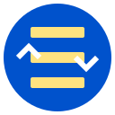

# Diff Navigator Extension

A Chrome extension that helps you navigate through elements with a specific CSS class on any webpage. Perfect for reviewing changes, finding highlighted elements, or navigating through any elements sharing the same class.



## Features

- Navigate through elements with any specified CSS class
- Up/down navigation buttons
- Current element counter (e.g., "3/12")
- Smooth scrolling to elements
- Visual highlight effect when navigating
- Persistent class name storage
- Works on any webpage

## Installation

### From Source

1. Clone this repository:

```bash
git clone https://github.com/Mehdiway/CSSClassNavigator.git
```

2. Open Chrome and navigate to `chrome://extensions/`
3. Enable "Developer mode" in the top right
4. Click "Load unpacked"
5. Select the directory containing the extension files

## Usage

1. Click the extension icon in your Chrome toolbar
2. Enter the CSS class name you want to navigate through (e.g., "diff-html-added")
3. Use the up/down arrows to navigate between elements with that class
4. The counter shows your current position and total number of elements

## Files

- `manifest.json`: Extension configuration
- `popup.html`: UI for the extension popup
- `popup.js`: Popup interaction logic
- `content.js`: Page interaction and navigation logic
- `icon.png`: Extension icon

## Technical Details

The extension uses:

- Chrome Extension Manifest V2
- Chrome Storage API for saving preferences
- Chrome Tabs API for communication
- DOM manipulation for element navigation
- CSS transitions for smooth visual effects

## Development

To modify the extension:

1. Make your changes to the source files
2. Go to `chrome://extensions/`
3. Click the refresh icon on the extension card
4. Test your changes

## Contributing

1. Fork the repository
2. Create your feature branch (`git checkout -b feature/AmazingFeature`)
3. Commit your changes (`git commit -m 'Add some AmazingFeature'`)
4. Push to the branch (`git push origin feature/AmazingFeature`)
5. Open a Pull Request

## License

This project is licensed under the MIT License - see the [LICENSE](LICENSE) file for details

## Credits

Created by [Your Name]

Icon design features:

- Blue circular background (#0052CC)
- Yellow highlighted blocks representing text elements
- White navigation arrows with black outlines

## Support

If you encounter any problems or have suggestions:

1. Check existing issues
2. Open a new issue with:
   - Clear description of the problem/suggestion
   - Steps to reproduce (if applicable)
   - Expected behavior
   - Screenshots (if applicable)
